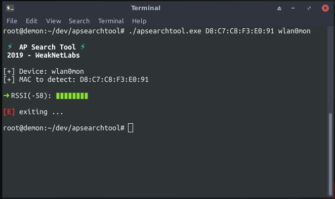
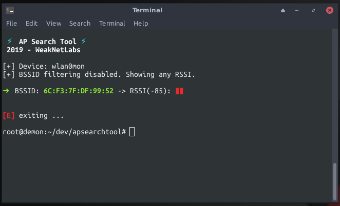

# AP Search Tool
AP Search Tool
Utilizes the RSSI in the RadioTap header to find the physical location approximation of an AP by filtering for the BSSID in the packets.
## Preparing for the scan
You must first get your wireless adapter into monitor mode. You can use the ```airmon-ng``` utility from [Aircrack-NG](https://github.com/aircrack-ng/aircrack-ng)
## BPF BSSID Filter
You can easily search via BSSID by passing it as a command line argument,

## Scan all BSSIDs
You can scan for all detected BSSIDs (using a BPF for 802.11 beacons) by implying a "0" or other singular byte value via the command line as so,


~Douglas
